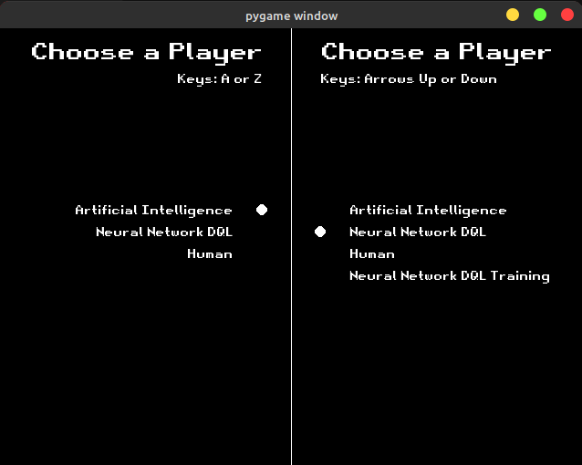

# ping-pong-ia

Project to pratice Pytorch



## Menu

- [How to run](#how-to-run)
- [How to play](#how-to-play)
- [My Notes](#my-notes)
- [My References](#my-references)
- [Freeze Dependencies](#freeze-dependencies)

## How to Run

```sh
python3 -m venv venv
source venv/bin/activate
pip3 install -r requirements.txt
python3 main.py
```

## How to play

Select two of the below players with `ENTER`

| player                      | implementation | description                                                                   |
| --------------------------- | -------------- | ----------------------------------------------------------------------------- |
| Human                       | PlayerHuman.py | Control with A and Z or Up and Down                                           |
| Artificial Intelligence     | PlayerAI.py    | Keep the player in the same horizontal position of the ball when it is coming |
| Neural Network DQL          | PlayerNN.py    | Execution of Neural Network Deep Q-Learning                                   |
| Neural Network DQL Training | PlayerNN.py    | Training of Neural Network Deep Q-Learning                                    |

## My Notes

1. This model was trained for approximately 100 hours.

2. Had to restart a few times to get back to training from a reasonable solution.

3. So far I haven't managed to make NN beat simple programming logic 100% of the time!

## My References

Reference Code: https://github.com/python-engineer/snake-ai-pytorch

Reference Tutorial: https://www.youtube.com/watch?v=PJl4iabBEz0

## Freeze Dependencies

```sh
pip freeze > requirements.txt
```
